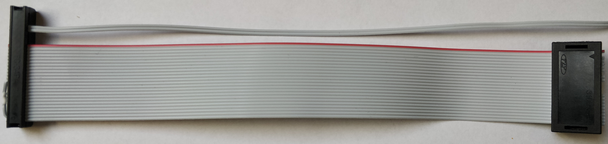

# EPROM_EMU_NG_FW_2708

This is a modification of the original EPROM NG to handle also 1kB EPROMs 2708. The motivation for this project was the fact that I got an 8080 single-board microcomputer (SBC) from my brother. It is an SBC that was produced in Czechoslovakia in 1982 by a company named TESLA. Yes, TESLA! It was established in 1921 as Electra and renamed to TESLA in 1946, so it is quite older than America's Tesla. Even though a lot of stuff was just a copy of components from the west, it used to have quite high quality. One of the most successful products was the "school microcomputer" PMI-80, based on the 8080 CPU.

PMI-80 

As you can see in the picture above, all the parts are produced by TESLA. To my surprise, one enthusiast from Slovakia created a clone of this SBC, and it is still available. You can see it here, the [PMI-80 replica](https://github.com/TomasPavlovicPavlo/PMI-80) replica. It is very well made and documented, so it is worth checking.

After I've made it work 

and played with it a bit I realized that typing a binary code from a keyboard is really not very pleasant, to say it mildly, so I was looking for some more convenient way to enter data into the memory of this SBC. As you can see from the picture above, there is one free position on the left side of the board, which is reserved for an additional EPROM. In this case the position is for an EPROM of type I2708, which has a size of 1 kB. So the easiest solution that came to my mind was using an EPROM emulator. After some googling, I found one that can be easily built and also supports memory 2716, which can be used also in this case for 2708, as it will not collide with anything above its memory range as there is nothing to be addressed on this board. But I also made some modifications to accommodate 2708 memories, which will be described later. The emulator can be seen here: [EPROM Emulator Project with Arduino](https://github.com/Kris-Sekula/EPROM-EMU-NG). You can also buy a PCB and populate it yourself on eBay, for example, here [Eprom Ng](https://www.ebay.de/sch/i.html?_dkr=1&iconV2Request=true&_blrs=recall_filtering&_ssn=zp-sixbits&store_name=zpsixbits&_oac=1&_nkw=eprom%20ng) or here [EPROM Emulator NG](https://www.ebay.co.uk/itm/116341805460?_ul=GB&rb_itemId=116341805460&rb_pgeo=GB&var=0&ff=11&mkevt=1&mkcid=1&mkrid=710-53481-19255-0&campid=5339059258&toolid=10044&customid=Cj0KCQjwna6_BhCbARIsALId2Z3Gkpf4sCDU-jGEYT3FRDttLKcGpocQ_yg2X65dxdOC0kL8VQIMt08aAmnSEALw_wcB&gad_source=1&gclid=Cj0KCQjwna6_BhCbARIsALId2Z3Gkpf4sCDU-jGEYT3FRDttLKcGpocQ_yg2X65dxdOC0kL8VQIMt08aAmnSEALw_wcB). So I bought a PCB and populated it myself.

EPROM EMULATOR 2.2d

The next challenge was a cable between the emulator and the PMI-80 EPROM socket.

Cable 2708

As you can see, I could make it, with some tricks, without any visible ugly cable crossing. The details of the cable construction are [here](hardware/README.md).

So now we are ready to use the emulator even with the original software, but as mentioned above, I've made some modifications so 2708 now can be selected from the GUI or via the command line. The modified software is [here](software).

When software is flashed to Arduino, we can connect the emulator to SBC. Below is a picture of PMI-80 connected to the emulator.

EMU_NG connected to PMI-80

I've also included an example of source code that I used for testing the emulator. It is a slightly modified version of the example from the [PMI-80 replica](https://github.com/TomasPavlovicPavlo/PMI-80). The modified example is [here](examples).
