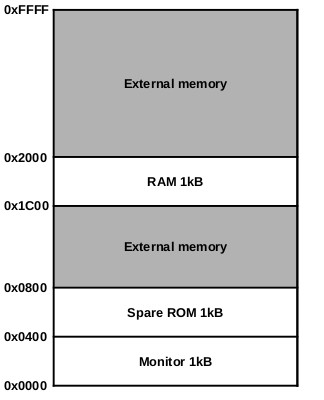
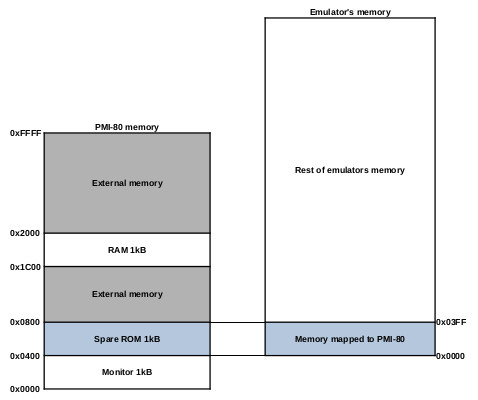
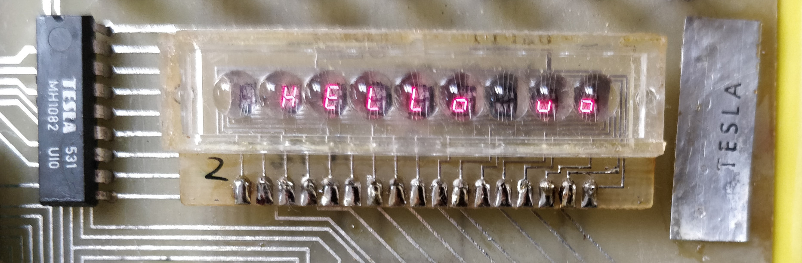

# Examples

The following example is 8080 assembler code for running "Hello world" text on the 7-segment display of the PMI-80. There are 2 ROM positions for 2708 chips on this microcomputer. The first position is occupied by monitor programma, so only the second one can be used. The second position starts at an address of 0x0400, and the memory space is from 0x0400 to 0x03ff. This example is not useful on other microcomputers then the PMI-80, but I would like to highlight what to expect when you use this emulator on microcomputers like this one.

The memory map of the PMI-80 looks like the in following picture.

## Problem

The problem is that even though the address starts at 0x0400, only A0 - A9 addresses are used so basically emulator needs to put a programm at starting address 0x0000. Memory mapping for PMI-80 looks like below.

When you write a program that starts at 0x0400 and you generate a HEX file from it, the emulator will place it also at an address starting at 0x0400. But when the PMI-80's memory location 0x0400 - 0x0700 is addressed, it will address only the first 0x0000 - 0x03ff of the emulator, not 0x400 - 0x0700. Emulator doesn't have an option to "reallocate" a starting address for HEX files, let's say from 0x0400 to 0x0000. But it can define a starting address for binary files. And that works just fine. I use the xa80 cross compiler to compile the code. It can compile a code for 8080, 8085, Z80, and Z180, and it can be found [here]( https://github.com/duncanamps/xa80). It can generate HEX and also binary code so you can upload a binary code to the emulator with start address 0x0000 (defined either from the GUI of the emulator or via its command line). And then the microcomputer can see it at an address of 0x0400. An example of eprom_ng GUI screenshot for this situation is below.

In the picture above you can see that eprom 2708 is selected, the start address in the emulator memory is 0x0000, and the file name is running_text.com, which is a binary file generated by the xa80 cross compiler.

## Real example

With the xa80 crosscompiler, you can use the following command to generate a binary .com file that can be uploaded to the emulator. I set env to some default values so I don't have to repeat it every time I compile the code. I put the following line in my .bashrc:

`export XA80='--processor=8080 --listing=*'`

So now I can simply call a compile as in the following example.

`$ xa80 running_text.asm -c`

This will generate a binary file named running_text.com that can then be sent to the emulator. Screenshot is below.

Or short video with rolling text is [here](../pictures/running_text.mp4)
