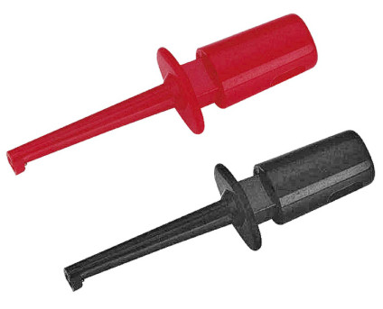

### Emulator cable for 2708 EPROM

To start with this topic it is worth checking the schematic of the emulator itself. It can be seen here [EPROM-EMU-NG/Hardware/2.2d](https://github.com/Kris-Sekula/EPROM-EMU-NG/blob/master/Hardware/2.2d/1002_EPROM_EMU_NG_2.2d.pdf).

If you check the part which is responsible for memory size selection

Address range selector

As you can see above the memory used for the emulator is 128K x 8 bit. Addresses A0 - A10 are freely addressable and addresses A11 - A15 can be enabled or set to low (log 0) by signals EN_A11 - EN_A15 which can be set by software. Address A16 is wired to GND so always "0" and with this configuration we can emulate 64K x 8 memory which is enough for 8 bit CPUs which have "only" 16 bit address bus.  To address 2K memory range you need only addresses A0 - A10. For this reason the EN_AN11 - EN_AN15 are set to log 0 by software. And really there is a part of sourcode doing exactly this.

      Serial.println(F( "-> Bus set to 2716 EPROM Memory"));
      digitalWrite( EN_A11, LOW );
      digitalWrite( EN_A12, LOW );
      digitalWrite( EN_A13, LOW );
      digitalWrite( EN_A14, LOW );
      digitalWrite( EN_A15, LOW );

Now for memory 2708 we would need to set also A10 to "0" so only A0 - A9 can be used. But there is not a free register on PCB that we can use for this. But from the schema you can also see that addresses from emulated memory are separated by buffer 74HC541 (U10, U11) and they are enabled by signal RESET only when emulator starts emulation.  So we can do a dirty trick and connect the signal E_10 to "0" in the cable itself so whenever the cable is used and 2716 is selected then A10 is "0" and also A11 - A16 are set to "0" so 2708 is emuleted. Disadvantage is that this cable can be used only for memory of type 2708. For memories 2716 you would need to use also A10 which needs to be connected to correspinding pin. I've made also some minor modifications in the software so also memory 2708 can be selected to prevent some confusions. It is sort of copy and paste of sections for 2716 with some limits on range of data that can be sent to emulator's memory. Below you can see the schematic of the cable.

Note the connectionbetween E_A10 and GND and also /OE and /CS signals are connected together as 2708 has only one /CS signal. VBB, VCC, VDD and PROG signals are disconnected so emulator cannot be powered from SBC. VCC (+5V) can be connected to the emulator and in that case emulator is powered from SBC, but then extra wire is needed and to my opinion it would be quite ugly looking solution. On the other hand you use the emulator mainly for programming in which case ih has to be connected to PC so emulator is powerd from PC's USB so "VCC" connection is not needed.

I could manage to hide the connection betwee /OE and /CS inside the 24 pin EPROM socket.

But I couldn't cross the wires A10 and GND on emulator side so I made a connection outside.

So the complete cable look nice and neat.

Two extra cables on upper part of the picture are RESET and /RESET that can be used to reset SBC after data is loaded to the emulator. They can be connected to test clips like the ones below

 

and then attached to RESET pin of the SBC.
